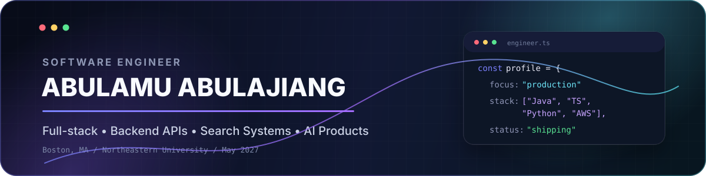

  

  
  
  
  

  

## About

I build reliable software across **full-stack products, backend APIs, search systems, and AI-enabled workflows**. I am pursuing an **M.S. in Computer Science at Northeastern University** and expect to graduate in **May 2027**.

My recent work spans **Next.js, Express.js, Spring Boot, FastAPI, MongoDB, MySQL, Redis, AWS, Docker, automated testing, and CI/CD**.

## Impact at a glance

<table>
  <tr>
    <td align="center" width="25%">
      <strong>1,000+</strong> 
      registered brands served
    </td>
    <td align="center" width="25%">
      <strong>50K+</strong> 
      products supported by search APIs
    </td>
    <td align="center" width="25%">
      <strong>23%</strong> 
      average query-latency reduction
    </td>
    <td align="center" width="25%">
      <strong>90%</strong> 
      coverage on assigned backend modules
    </td>
  </tr>
</table>

## Engineering experience

### Fashion Index · Full Stack Developer Intern

- Helped launch the **Fashion Index 3.0** platform within a four-developer team, owning the B2B advertising module across **Next.js, Express.js, MongoDB, and AWS S3**.
- Designed a **six-state campaign lifecycle** with guarded transitions, role-aware moderation, scheduled expiry, unread queues, and MongoDB TTL cleanup.
- Diagnosed a long-standing **JWT authentication defect** that blocked authorized uploads and strengthened backend authorization checks.
- Redesigned **FastAPI + MongoDB** search and filtering APIs for a catalog with **50K+ products**.
- Expanded release confidence with **Redux Toolkit checks, Jest, Supertest, regression testing, peer review, and production-build validation**.

### Wanglan General Technology · Software Engineer Intern

- Developed **Java + Spring Boot REST APIs** for work orders, inventory, purchasing, authentication, validation, and pagination.
- Optimized **MySQL + Redis** access paths through indexing, caching, batch operations, and query refactoring, reducing average latency by **23%**.
- Supported React-based factory dashboards through DTO validation, service orchestration, and DAO-layer implementation.
- Used **JUnit, integration testing, Docker, GitHub Actions, CI/CD, and code review**, maintaining **90% coverage** across assigned modules.

## Featured projects

<table>
<tr>
<td width="50%" valign="top">

### 🤖 Task Tracker Agent

Transforms text and voice input into structured tasks with due time, category, priority, people, location, and status.

**Highlights**

- FastAPI service and SQLite persistence
- OpenAI API and LangChain prompt workflows
- Rule-based validation and missing-field inference
- Search, CRUD, completion tracking, and task history

**Stack:** `Python` `FastAPI` `LangChain` `OpenAI API` `SQLite`

</td>
<td width="50%" valign="top">

### 🐾 Pet Adoption Platform

A full-stack adoption platform covering browsing, filtering, favorites, adoption records, authentication, and cloud release.

**Highlights**

- Released to **200+ Northeastern student users**
- Improved page responsiveness by **27%**
- Cached search results and normalized favorites state
- Indexed MongoDB collections for common workflows

**Stack:** `React` `Node.js` `Express.js` `MongoDB` `Redux Toolkit Query` `GCP`

</td>
</tr>

<tr>
<td width="50%" valign="top">

### 📱 Android Task Tracker

A mobile task-management application supporting creation, editing, status tracking, offline persistence, and cloud synchronization.

**Highlights**

- MVVM architecture
- Jetpack Compose interface
- Room-based offline persistence
- Kotlin Coroutines and AWS Amplify synchronization

**Stack:** `Kotlin` `Jetpack Compose` `Room` `AWS Amplify`

</td>
<td width="50%" valign="top">

### 🌐 Personal Portfolio

A public portfolio for presenting engineering experience, projects, and technical skills.

  
  

**Focus:** responsive presentation, project discovery, and a clear recruiter-facing overview of my work.

</td>
</tr>
</table>

> Project source buttons can be added to the first three cards after their exact public repository names are confirmed.

## Technology stack

  <strong>Languages</strong>  
  

  <strong>Frontend and backend</strong>  
  

  <strong>Data, cloud, and delivery</strong>  
  

## GitHub activity

  

  

  <picture>
    <source media="(prefers-color-scheme: dark)" srcset="https://raw.githubusercontent.com/abram0102/abram0102/output/github-contribution-grid-snake-dark.svg" />
    <source media="(prefers-color-scheme: light)" srcset="https://raw.githubusercontent.com/abram0102/abram0102/output/github-contribution-grid-snake.svg" />
    
  </picture>

---

  Open to 2027 new-grad Software Engineering, Backend, and Full-stack opportunities.

