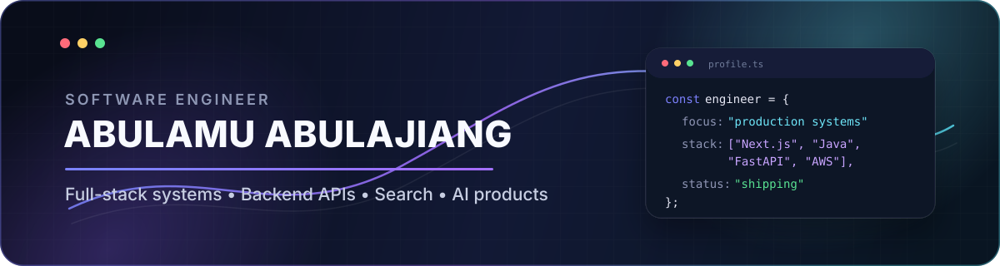

  

  
  
  

  

## About me

I am a software engineer focused on **production full-stack systems, backend APIs, search infrastructure, and AI-enabled products**.

- 🎓 M.S. in Computer Science at **Northeastern University**, graduating **May 2027**
- 🧱 Experienced across **Next.js, Express.js, Spring Boot, FastAPI, MongoDB, MySQL, Redis, and AWS**
- 🚀 Comfortable owning features from system design and API development through testing, CI/CD, and production release
- 🔎 Exploring **2027 new-grad Software Engineering, Full-stack, and Backend opportunities**

## Engineering highlights

<table>
<tr>
<td width="50%" valign="top">

### Production full stack

Built the B2B advertising module for the Fashion Index 3.0 platform using **Next.js, Express.js, MongoDB, and AWS S3**, supporting advertiser uploads, admin review, and live campaign serving for a marketplace with **1,000+ registered brands**.

</td>
<td width="50%" valign="top">

### Search at scale

Redesigned **FastAPI + MongoDB** search and filtering APIs for a **50K+ product catalog**, adding tokenized matching, aggregation-driven filter counts, and resilient handling for incomplete supplier data.

</td>
</tr>
<tr>
<td width="50%" valign="top">

### Backend engineering

Developed **Java + Spring Boot** REST APIs for factory-management workflows and optimized **MySQL + Redis** data access, reducing average query latency by **23%**.

</td>
<td width="50%" valign="top">

### Quality and delivery

Worked with **JUnit, Jest, Supertest, Docker, GitHub Actions, CI/CD, integration testing, and peer code review**, maintaining **90% coverage** across assigned backend modules.

</td>
</tr>
</table>

## Selected work

### 🤖 Task Tracker Agent

A Python and FastAPI-based agent that converts text and voice input into structured tasks, using **OpenAI API, LangChain, rule-based validation, and SQLite persistence** to infer metadata and recommend practical next steps.

### 🐾 Pet Adoption Platform

A full-stack application built with **React, Node.js, Express.js, MongoDB, and Redux Toolkit Query**, released to **200+ Northeastern students** and optimized to improve page responsiveness by **27%**.

## Technology stack

  <strong>Languages</strong> 
  
  
  
  
  

  <strong>Frontend and backend</strong> 
  
  
  
  
  
  
  

  <strong>Data, cloud, and delivery</strong> 
  
  
  
  
  
  
  
  

## GitHub activity

  
  

  <picture>
    <source media="(prefers-color-scheme: dark)" srcset="https://raw.githubusercontent.com/abram0102/abram0102/output/github-contribution-grid-snake-dark.svg" />
    <source media="(prefers-color-scheme: light)" srcset="https://raw.githubusercontent.com/abram0102/abram0102/output/github-contribution-grid-snake.svg" />
    
  </picture>

---

  Building reliable systems, learning continuously, and shipping work that users can feel.

